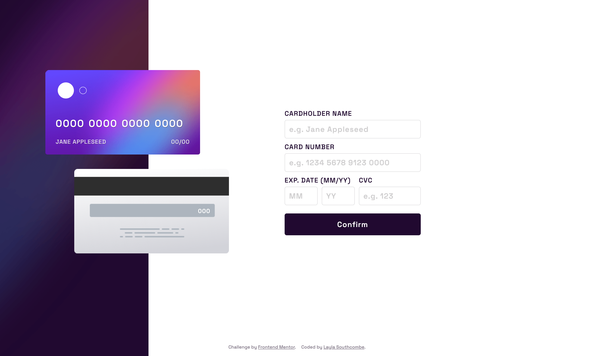
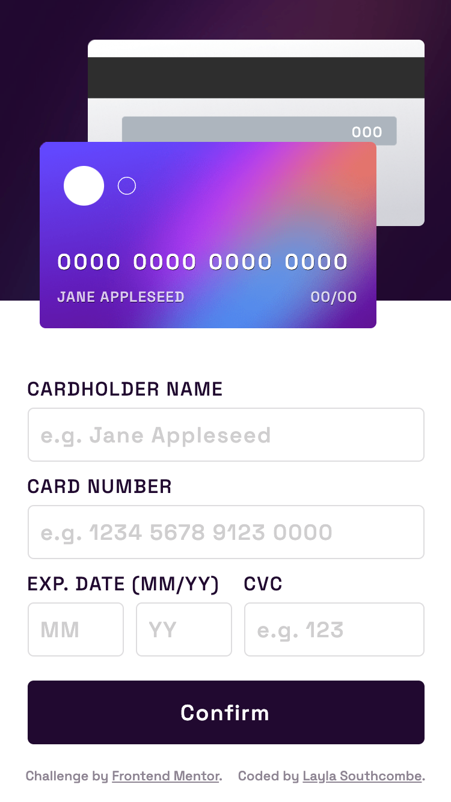
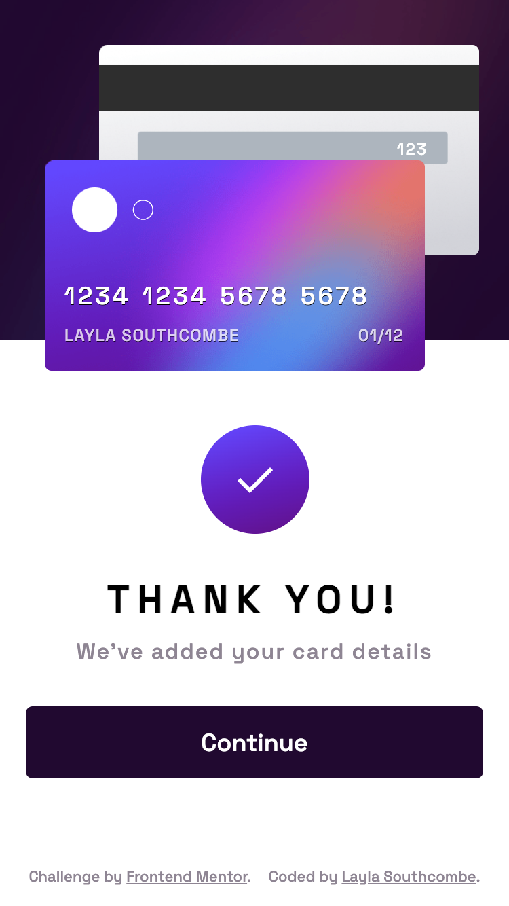

# Frontend Mentor - Interactive card details form solution

This is a solution to the [Interactive card details form challenge on Frontend Mentor](https://www.frontendmentor.io/challenges/interactive-card-details-form-XpS8cKZDWw). Frontend Mentor challenges help you improve your coding skills by building realistic projects. 

## Table of contents

- [Overview](#overview)
  - [The challenge](#the-challenge)
  - [Screenshot](#screenshot)
- [My process](#my-process)
  - [Built with](#built-with)
  - [What I learned](#what-i-learned)
- [Author](#author)


## Overview

### The challenge

Users should be able to:

- Fill in the form and see the card details update in real-time
- Receive error messages when the form is submitted if:
  - Any input field is empty
  - The card number, expiry date, or CVC fields are in the wrong format
- View the optimal layout depending on their device's screen size
- See hover, active, and focus states for interactive elements on the page

### Screenshot





## My process

### Built with

- Semantic HTML5 markup
- CSS custom properties
- Flexbox
- CSS grid
- Mobile-first workflow

### What I learned

How to write functions to stop numbers or only numbers being written in text inputs, and how to easily obtain form data upon submission.

```js
let reg = new RegExp('^[0-9 ]+$');
numberInputs.forEach(x => {
    x.addEventListener("input", (e) => {
        if(!reg.test(e.target.value)){
            e.target.value = e.target.value.slice(0, -1)
        }
    })
})
```

## Author
- Frontend Mentor - [@LaylaSouthcombe](https://www.frontendmentor.io/profile/LaylaSouthcombe)